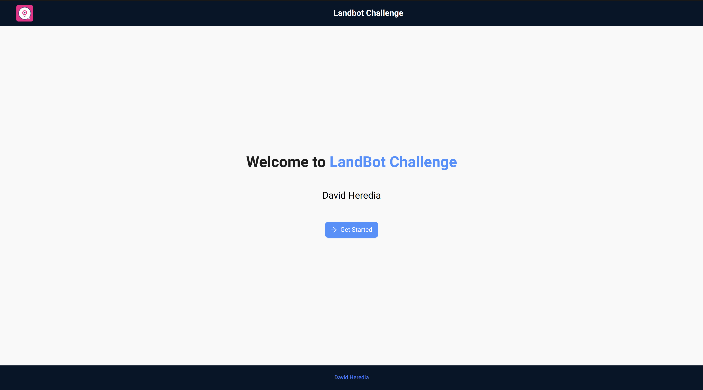
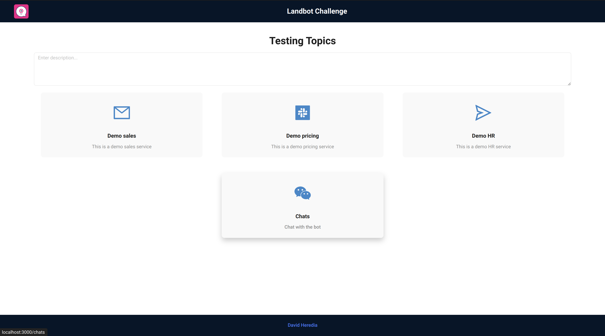
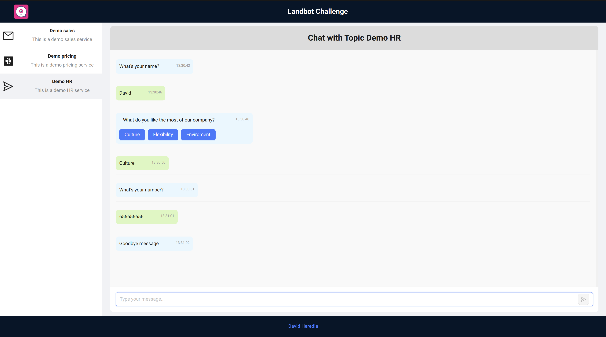
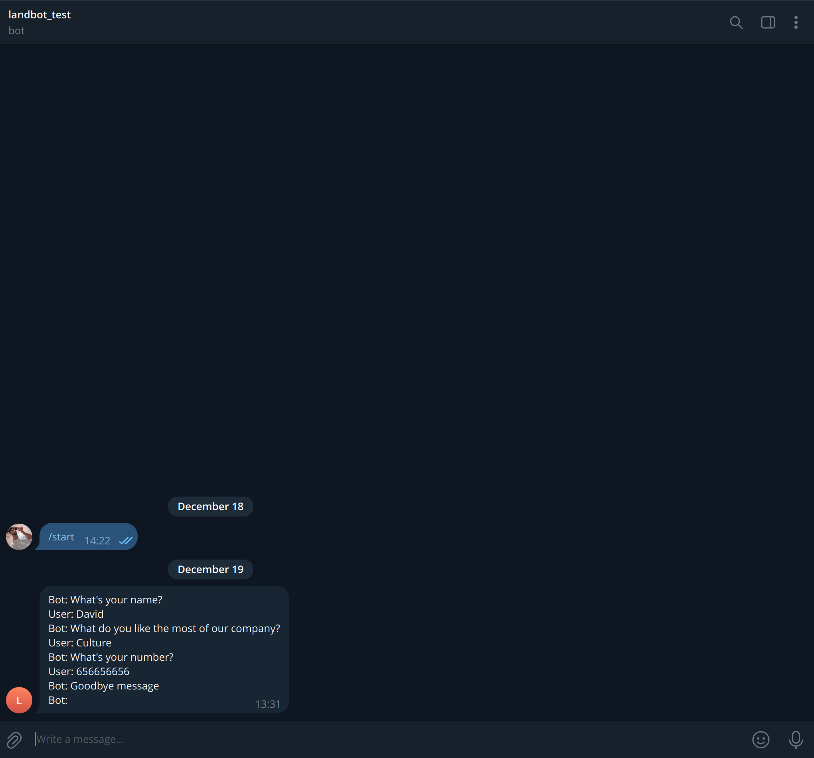
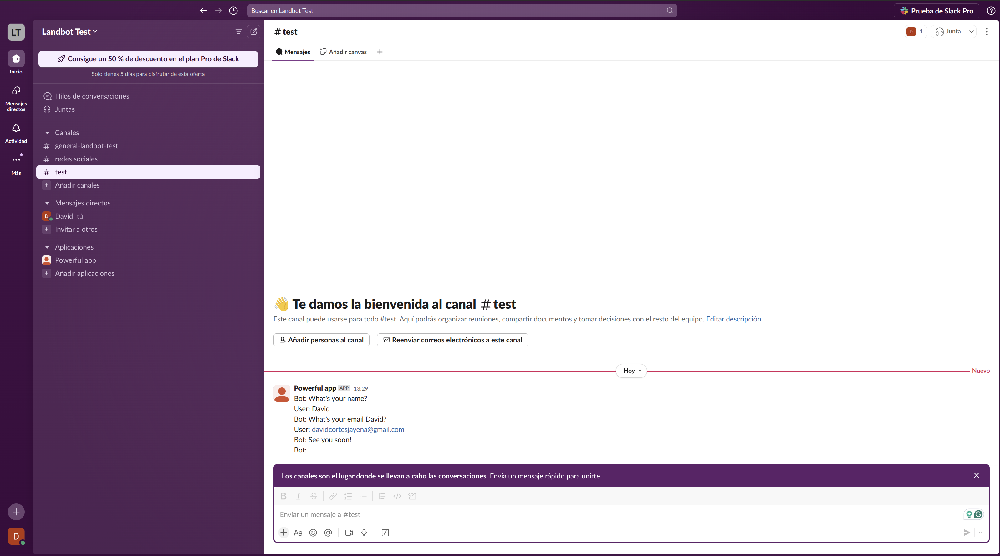
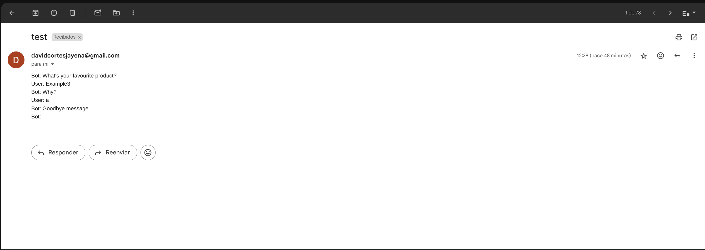

## 💡 Project Overview

Welcome to our project, developed as part of the **Landbot Frontend Challenge**! 🚀 The goal was to create a versatile application that allows users to interact with different bots based on their specific needs, leveraging the powerful capabilities of the `@landbot/core` library.

### 🎯 Challenge Objective

Implementing a conversational experience can be tricky. With the latest release of `@landbot/core`, creating a conversational interface or a sequential messaging use case has become more accessible. Our mission was to utilize this tool to develop a unique chat UI or a small website widget with onboarding capabilities, all built with **React**.

### 🛠️ What We Built

We designed a small app that lets users enter and receive assistance from various bots tailored to their requirements. This application serves as a foundation for creating custom conversational experiences, enhancing user engagement and streamlining interactions.

---

### 🌐 Landing Page

Entrypoint to the app.

### 🛠️ API Testing

Ensure the reliability and robustness of the integrations with this little API testing tool.

### 💬 Chat Management

Manage and monitor all chat interactions from a centralized dashboard.

---

## 🎉 Integration Demonstrations

Explore how our project integrates seamlessly with various third-party services. Below are the demonstrations showcasing the functionality of each integration. Messages are received in the accounts you have configured.

### 🤖 Telegram Integration

Our Telegram bot allows real-time communication and interaction directly within your Telegram app.

**Features:**
- Receive user's conversation effortlessly.
- Manage topics through the Django admin panel.
- Real-time notifications and updates.

*Messages are received in the Telegram account you configured.*

---

### 💬 Slack Integration

Integrate with Slack to enhance team collaboration and streamline your workflows.

**Features:**
- Automated message posting to Slack channels.
- Receive alerts and notifications.
- Manage Slack interactions via the backend.

*Messages are received in the Slack account you configured.*

---

### 📧 Gmail Integration

Stay updated with email notifications and manage your communications efficiently.

**Features:**
- Send automated emails for various triggers.
- Receive and handle incoming emails.
- Secure email handling with environment configurations.

*Emails are received in the Gmail account you configured.*

